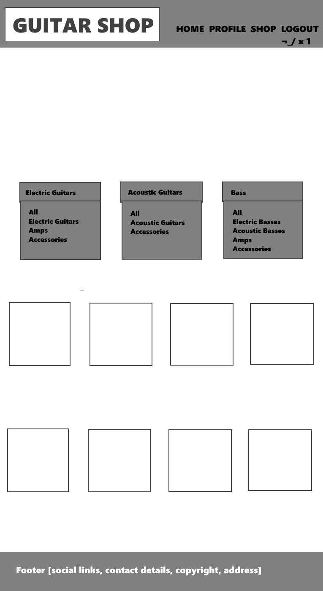
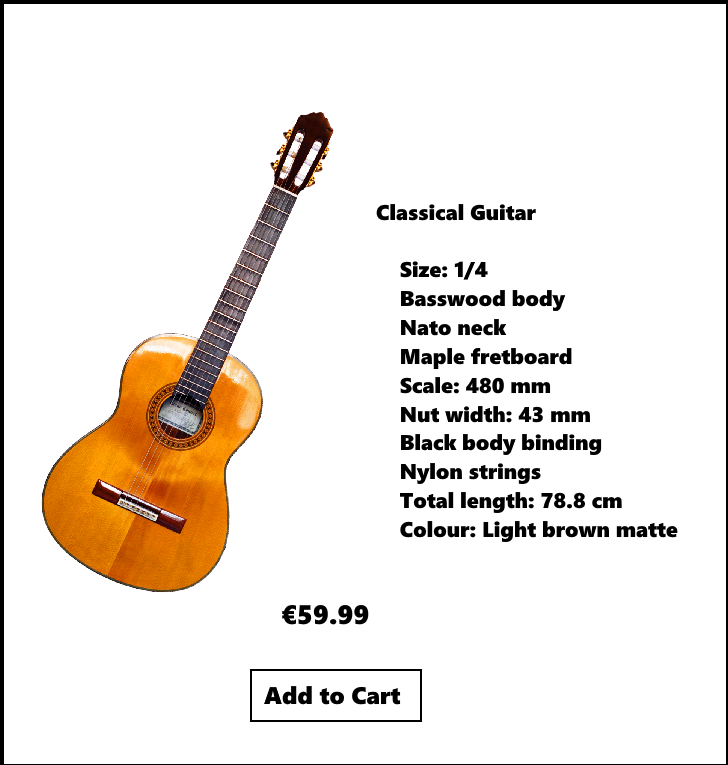

# Silverstring

The live website can be found [here](https://silverstring.herokuapp.com/).

Silverstring is an online ecommerce platform dedicated providing customers with guitars and guitar accessories. 

For test purposes, purchases can be made using card details "4242 4242 4242 424242"

## Testing

Documentation on testing and deployment can be found in TESTING.md

## UX

This website is designed with these users as the focus.

### Visiter

### Shopper

### Store Owner

## User Stories

This website is designed with these users as the focus.

As a/an| I want to be able to | So that I can | Addressed
------- | -------- | ------- | ------
Shopper | View a list of products | Select some to purchase | Shop link displays product listings
Shopper | View individual product details | See the price/description/rating/| Clicking on product card in product listings displays product details
Shopper | View the total of my purchases at any time | adjust my purchases accordingly | Clicking on the "shopping cart" icon displays the current total and allows for users to update/remove the quantity of items
Site User | Register for account | Have an account/view my profile | Registration can be accessed by clicking account icon
Site User | Login/logout | Access my account | Option to login/logout on clicking "person" icon
Site User | Have a personalised user profile | View order history/save payment info | Profile page available after login, shows order history/payment info
Site User | See upcoming events | View the catalogue in person | Showcase page lists upcoming events and information
Site User | Leave a review | Let other user know of the quality of a specific product | Product details page contains form input to leave a review
Site User | See product reviews | Learn of other customers experiences with a specific product | Product details page contains list of product reviews
Shopper | Search for a product | Find a specific product | Search form included in store page, can search by name/description
Shopper | See what I've searched for | Quickly decide if what I want is there | Search form filters results by search criteria
Shopper | Select qty of product when purchasing | Ensure I don't select wrong quantity| Qty selector forms included on product details page
Shopper | View cart | See total cost/all items  |  Clicking "bag" icon, lists products, total cost and subtotals.
Shopper | Adjust qty of items in my cart | Make changes to the cart before checkout |  update/remove is available in the cart
Shopper | Enter payment info | Checkout | Payment info can be filled in on checkout page
Shopper | View an order confirmation after checkout | Verify the order | Order confirmation appears on profile page 
Store Owner | Add a product | Add new items to store | Admin user is able to add products via Product management
Store Owner | Edit/update a product | Change product details | Admin user is able to edit products via product/product detail pages
Store Owner | Delete a product | Remove items not for sale | Admin user is able to delete products via product/product detail pages

## Strategy

This site is primarily a B2C wesite, and proof of concept for a working ecommerce platform.
The goal is to provide the user with an intuitave experience, and the ability to browse and purchase instruments online.


## Scope

Visitors should be provided with enough information quickly to determine that this is an online shop.
The user will be able to navigate the site via the navbar.
They will be able to make a profile and  leave a review on products.
They will be able to make a purchase using a credit card.
The user will be able to view upcoming showcases where they can see the products in person.
The admin will have the ability to update the store.


## Structure

The Logo/Brand is always visible at the top left of the page, in the navbar and will verify for the user that they are in the right place.
This also acts as a home button which will redirect the user back to the homepage.
The homepage will appear first with the navbar providing the user to other pages on the site.
On mobile devices the navbar links will be available to the right via a dropdown 'hamburger' icon.

### Three instances of the navbar

#### For the visitor.

1. Home
2. Shop
3. Showcase
4. Account (Login/Register)
5. Cart

#### For the registered user (logged in).

1. Home
2. Shop
3. Showcase
4. Account (My Profile/Logout)
5. Cart

#### For the Administrator (logged in).

1. Home
2. Shop
3. Showcase
4. Account (My Profile/Product Management/Logout)
5. Cart

### The following pages cannot be accesed via the nav bar.

1. Update Product
2. Delete Product

These are only accesible to the site admin via the products and product details page.

### The Collapsible Navbar.
The Navbar will collapse on mobile devices to fit smaller screens.
Navbar links can be accessed via a dropdown menu.

## Skeleton

The following schema was drawn using Draw SQL
https://drawsql.app/


## Surface

The following wireframes were created using paint.net

The Products page, featuring the navbar, link layout and product sorting.


The Product Details page


The site ended up looking quite different to this as development progressed.

## Security Features
Stripe is used to handle payment proccessing.
Allauth is used to manage accounts.
Secret Keys are stored in heroku config variables and so they cannot be accessed from the site.
The product management functionality can only be accessed by the administrator
Password reset will require email confirmation.


#### Responsiveness

The site scales relatively well from small screens to large.
Some issues can be found  however. These will be discussed in the testing section.

#### Logo/Home Button

The logo is present at all times at the top left of the page. 
It does not take up a large amount of space, but is prominent across the site and provides the user with a link to back to the homepage at all times.

#### Navbar

The user can navigate the site using the navbar.
The navbar will collapse on mobile devices and can bia accessed via a 'hamburger icon'. 

#### Homepage

The hmepage simply contains a hero-image and a text blerb.


#### Store Page

By clicking on the 'Shop' link in the navbar the user will be brought to the product directory page.
This will list all of the products in the database.
Alternatively the user will be brought here with the games filtered by the methods specified above.
The store page contains a search bar which allows the user to search for an item via a text input
The Store page also contains dropdown filters which allow the user to filter the store by category

##### The Categories include
- Electric Guitars, Electric Guitar Strings, Electric Guitar Accessories
- Acoustic Guitars, Acoustic Guitar Strings, Acoustic Guitar Accessories
- Bass Guitars, Bass Guitar Strings, Bass Guitar Accessories


#### Showcase Page

The Showcase Page consists of a table listing the upcoming events including the Location, Date, Time and Admission Fee

#### Account

The account icon will trigger a dropdown menu for the following options

#### Register

New users can register an account with a username and password. 

#### Log in 

Users who already have an account can log in here using their username and password.

#### Log out

Logged in users can log out here.

#### Product Management

This is is only visible to the admin.
It provides a link to the Add Product Page.

#### Add Product Page

The add product page provides the admin with a form where they can input the product fields such as name, description, image, price.
The product can then be added to the store.

#### Product Details

User can view the products full details by clicking on a product card from either in the store page.
This will contain the product's image, description, and the ability to either add the item to the cart or continue shopping.
This page also contains the review section whereby users can see reviews left by visitors, or add their own if they are logged in to a registered account

#### Edit/Delete

Only visible to the admin on the product card or in the product details page.
The delete button will delete the itemn from the database.
The edit button will direct the admin to the update product page where they can alter the products details and price

#### Cart

The cart allows the user to see the items they have clicked to purchase.
Items can be removed, and quantities can be updated here before proceeding to the checkout

#### Checkout

The Checkout will provide users with the ability to input their billing information and purchase the item.
The billing information can also be save to the user profile so that they don't need to fill the form fields every thime a purchase is made.

## Technologies Used

- [HTML5](https://en.wikipedia.org/wiki/HTML5)
    To provide the base structire of the web pages


- [CSS3](https://en.wikipedia.org/wiki/CSS3)
    To provide the styling of pages 


- [Bootstrap](https://www.getbootstrap.com/)
    To simplify page layout and use of classes for simpler styling


- [Javascript](https://www.javascript.com/)
    To provide the site interactivity


- [jQuery](https://jquery.com/)
    Simplifies interactive web design.

- [Font Awesome](https://fontawesome.com/)
    Provides the icons used across the site
    
- [Google Fonts](https://fonts.google.com/)
    Provides the fonts used across the site

- [Gitpod](https://www.gitpod.io/)
    provides the development environment

- [GitHub](https://www.github.com/)
    hosts the files uploaded during production

- [Heroku](https://www.heroku.com/)
    A cloud platform for hosting the app.

- [Amazon Web Services](https://aws.amazon.com/)
   For storing image files and css

- [Django](https://www.djangoproject.com/)
    An open-source Python framework that is designed for quick launches.

- [Stripe](https://www.stripe.com/)
    For processing card payments

- [Paint.net](https://www.getpaint.net/)
    For designing the wireframes and editing images used across the site.

## Deployment

-Go to aws.amazon.com to and register an account
-Create a new bucket to store the media files/css
-Go to stripe.com to reveal your keys there

This website is deployed on [Heroku](https://www.heroku.com/), following these steps:
- Install the following packages to your local environment.
- [gunicorn](https://gunicorn.org/): `gunicorn` 
- [gninx](https://www.nginx.com/): `gninx` 
- [psycopg2-binary](https://pypi.org/project/psycopg2-binary/): 
- [dj-database-url](https://pypi.org/project/dj-database-url/): 
- type `pip3 freeze > requirements.txt` in the terminal to add the installed packages to the requirements.txt.
- Create a `Procfile` write `web: gunicorn silverstring.wsgi:application` in the file.
- `git add` and `git commit` and `git push` all the changes to the Github repositoty of this project.
- Create a new app in Heroku. Select the nearest region and click **Create app**.
- In Heroku navigate to  **Resources** , then **Add-ons** and find **Heeroku Postgres**, select **Hobby Dev — Free** and click **Submit Order Form** to add it to your project.
- Navigate back to the  Heroku Dashboard and click on **Setting** > **Reveal Config Vars** to set the following values:

AWS_ACCESS_KEY_ID:	Your AWS Access Key
AWS_SECRET_ACCESS_KEY: 	Your AWS Secret Access Key
DATABASE_URL: 	Your Postgres Database URL
SECRET_KEY: 	Your Secret Key
STRIPE_PUBLIC_KEY: 	Your Stripe Public Key
STRIPE_SECRET_KEY: 	Your Stripe Secret Key
STRIPE_WH_SECRET: 	Your Stripe WH Key
USE_AWS: 	True

- Migrate the database models to the Postgres database using the following commands in the terminal: python3 manage.py migrate
- Create a superuser for the Postgres database using the following command: python3 manage.py createsuperuser
- Install boto3 and django-storages via the terminal to connect AWS S3 bucket to Django.
- Freeze to requirements.txt
- Add the following in settings.py.
 
if 'USE_AWS' in os.environ:
    # Cache Control
    AWS_S3_OBJECT_PARAMETERS = {
        'Expires': 'Thu, 31 Dec 2099 20:00:00 GMT',
        'CacheControl': 'max-age=94608000',
    }

    # Bucket Config
    AWS_STORAGE_BUCKET_NAME = 'kaur-health'
    AWS_S3_REGION_NAME = 'eu-west-1'
    AWS_ACCESS_KEY_ID = os.getenv('AWS_ACCESS_KEY_ID')
    AWS_SECRET_ACCESS_KEY = os.getenv('AWS_SECRET_ACCESS_KEY')
    AWS_S3_CUSTOM_DOMAIN = f'{AWS_STORAGE_BUCKET_NAME}.s3-eu-west-1.amazonaws.com'

    # Static and media files
    STATICFILES_STORAGE = 'custom_storages.StaticStorage'
    STATICFILES_LOCATION = 'static'
    DEFAULT_FILE_STORAGE = 'custom_storages.MediaStorage'
    MEDIAFILES_LOCATION = 'media'

    # Override static and media URLs in production
    STATIC_URL = f'https://{AWS_S3_CUSTOM_DOMAIN}/{STATICFILES_LOCATION}/'
    MEDIA_URL = f'https://{AWS_S3_CUSTOM_DOMAIN}/{MEDIAFILES_LOCATION}/'

    # Roots
    STATIC_ROOT = os.path.join(BASE_DIR, 'staticfiles')
    MEDIA_ROOT = os.path.join(BASE_DIR, 'media')

- In Heroku enable automatic deployment from github
- Push all changes using git push heroku master.

## Making a Local Clone:
To make a local clone of the Silverstring website, enter ```git clone https://github.com/dvcoffey/silverstring.git``` into the
terminal. 

Alternatively, you can follow these steps, which are detailed on the official 
[GitHub Documentation](https://docs.github.com/en/github/creating-cloning-and-archiving-repositories/cloning-a-repository-from-github/cloning-a-repository)

Create an .env.py file in the root directory of the project, and add it to the .gitignore file. 
The following code needs to be added to the .env.py file:
```
import os  
os.environ["DEVELOPMENT"] = "True"    
os.environ["SECRET_KEY"] = "<Your Secret Key>"
os.environ["STRIPE_PUBLIC_KEY"] = "<Your Stripe Public Key>"    
os.environ["STRIPE_SECRET_KEY"] = "<Your Stripe Secret Key>"    
os.environ["STRIPE_WH_SECRET"] = "<Your Stripe WH Secret Key>"   
```

Install the required packages: 
pip install -r requirements.txt

Make migrations and then migrate in order to create a database, by running the following commands:
python3 manage.py makemigrations
python3 manage.py migrate.

Load the fixtures from the 'product_types.json' file and then from the 'products.json' file  contained in the 'fixtures' folder into the database. 
python3 manage.py loaddata <file name> 


Create a superuser with the following command: 
python3 manage.py runserver 

Enter your credentials.

Run the app by entering the following command:
python3 manage.py runserver

## Future Plans

I would like the cart to be more visible on mobile view. 
It is collapsed into the mobile navbar, which is an unforseen design flaw.
It would require a complete redesign of the navbar

Overall I would like to spend more time on the UX, and make the website look nicer.
For instance, the product images on the product details view could use a bit more styling, they are a bit cramped.

The Footer is a really just a social links container. but I would like it to contain more such as contact info.


## Sources and acknowledgements

The images and data for each product in this project were sourced on thomann.de.

The hero image was sourced from https://stephenarnoldmusic.com/sonic-branding/harp-guitar-banner/

https://www.w3schools.com/ was used for fast queries, mainly to check syntax and css parameters.

The Code Institute provided most of the educational resource required to build this project and this project is modelled heavily on the Boutique Ado Walkthrough project

Stack Overflow contained many helpful threads which were queried during development.

The Slack community and my fellow students at code institute for providing ispiration and assistance.

Tutor support who were incredibly helpful when I had issues with AWS Database configuration and review functionality

This website is built purely for educational purposes.